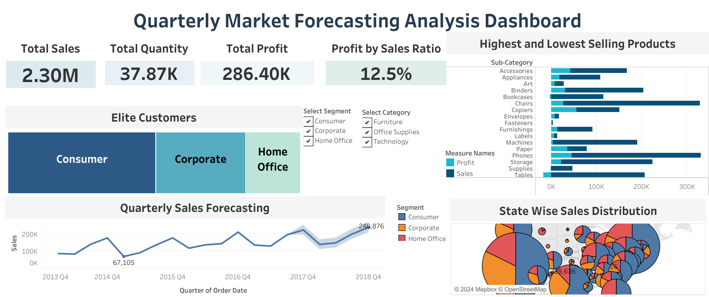

# Product Recommendation System for E-Commerce

## Project Overview
This project focuses on enhancing product recommendations and understanding market trends for an online retail platform. The goal was to develop a personalized recommendation system to improve user experience and optimize business strategies. Using a SQL-based data warehouse to store and manage customer and sales data, the project analyzed 10,000+ customer records, forecasted sales trends, and applied Python-based models for recommendation.

## Dataset Structure
The dataset is organized in a SQL-based data warehouse with multiple tables for customer data, sales records, product information, and regional market data. The primary data sources for this analysis are:

- **Superstore Data**: Purchase history and revenue data.
- **Superstore Reviews Data**: Ratings, reviews, and summaries provided by customers.

The dataset consists of over 10,000 records with 36 columns, including both features and target variables.

## Executive Summary
This project successfully implemented a SQL-based data warehouse and developed product recommendation models to enhance customer experience and drive sales growth. Key insights included:

- **Most Profitable Segment**: The "Consumer" category showed the highest revenue and profitability.
- **Top Performing Region**: California emerged as the most profitable market.
- **Underperforming Market**: North Dakota was identified as an area for improvement.
- **Sales Forecasting**: Predictions indicated growth in Q4 2018, providing opportunities for targeted marketing.

## Key Insights
1. **Profitable Market Segment**: The "Consumer" segment generated the highest revenue, indicating its importance.
2. **Top Performing Region**: California was the top market, significantly contributing to total sales.
3. **Underperforming Markets**: North Dakota required strategic attention to improve profitability.
4. **Growth Forecast**: The Q4 2018 forecast suggested opportunities for increased sales, especially through targeted marketing.

## Recommendations
1. **Capitalize on Growth Opportunities**: Allocate additional marketing resources to maximize sales in Q4 2018.
2. **Focus on the "Consumer" Category**: Develop targeted campaigns to boost profitability in this segment.
3. **Optimize Market Strategies**: Continue investing in California to maintain dominance in the region.
4. **Improve Underperforming Markets**: Conduct research in North Dakota to tailor marketing efforts and boost sales.

## Resources
- **SQL Queries**: Targeted SQL queries for business questions can be found [here].
- **Interactive Dashboard**: View the Tableau dashboard for sales trends [here].
- **Python Pipeline**: The Python pipeline for EDA, model building, and deployment can be found [here].

## Dashboard Snapshot
  

## Assumptions & Caveats
### Assumptions:
- The data used is accurate and reflects customer preferences and behavior.
- Sales forecasts are based on historical trends and assume no major disruptions in the market.

### Caveats:
- External factors, such as seasonal changes or economic shifts, may impact sales trends.
- The effectiveness of recommendation models may vary if customer preferences change or if insufficient data is available for new products.